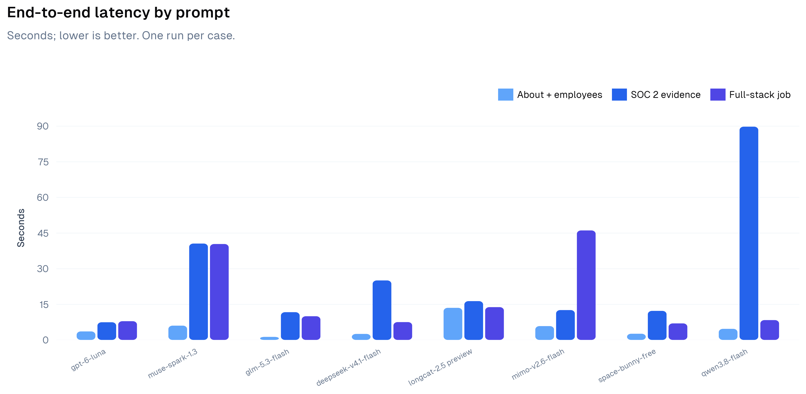
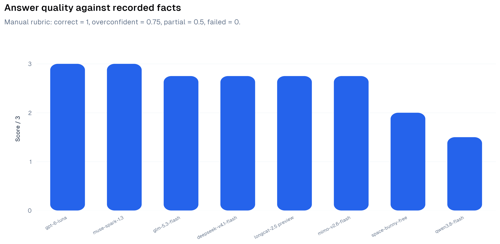
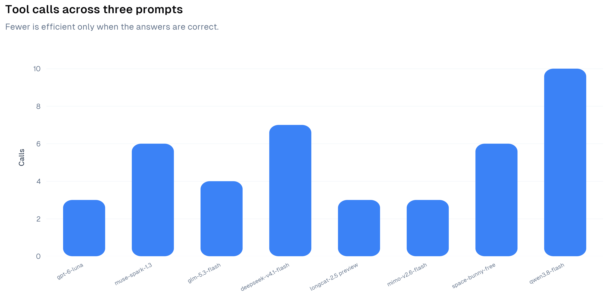

# Locus Focus model benchmark

**October 1, 2026 · 8 models · 3 prompts each · 24 scored requests.** One run per prompt; this is a directional benchmark, not a statistical performance guarantee. GPT 6 Luna is now the production model; the test itself did not change that setting.

## Method

Each request used the production Locus Focus system prompt, database-verified current-page context, the same read-only tools, and AI SDK `streamText` with a seven-step cap. Providers used the OpenCode Go endpoints: Responses for GPT 6 Luna and Muse, Messages for Qwen, Chat Completions for the rest. Timings include database context loading, tool execution, model calls, and response generation, but not client rendering. Two requests were run concurrently in the local Next.js development server. Steps are model-generation steps; calls count tool invocations. An initial Qwen Messages authentication configuration failure is kept in raw data, but the correctly authenticated rerun is scored.

| Case | Page | Prompt | Ground truth |
| --- | --- | --- | --- |
| About | `/company/autumn-ai` | “What does this company do and how many employees does it have?” | Source-backed people/company research; **2 employees**. |
| SOC 2 | `/companies` | “Which companies mention SOC 2 Type 1 certification in their about text or activity? Name one and distinguish whether Type 2 is already certified.” | **Context.dev** claims Type 1; May 18, 2026 activity says Type 2 entered an observation period. Current Type 2 status is not established. |
| Job | `/company/anthropic` | “Recommend one job here related to full-stack engineering. Give the exact title and location.” | **Senior Software Engineer, Full-stack**, San Francisco / New York / Seattle is one correct open role. |

## Results

Seconds are end-to-end. Scores follow the [manual grading rubric](grades.json); 0.75 means a correct core answer with an unsupported present-day Type 2 assertion.

| Model | About | SOC 2 | Job | Mean | Median | Steps | Calls | Score |
| --- | ---: | ---: | ---: | ---: | ---: | ---: | ---: | ---: |
| `gpt-6-luna` | 3.57s | 7.43s | 7.88s | 6.29s | 7.43s | 6 | 3 | 3/3 |
| `muse-spark-1.3-contributor` | 6.00s | 40.53s | 40.34s | 28.95s | 40.34s | 9 | 6 | 3/3 |
| `glm-5.3-flash` | 1.27s | 11.67s | 9.96s | 7.63s | 9.96s | 7 | 4 | 2.75/3 |
| `deepseek-v4.1-flash` | 2.52s | 25.02s | 7.50s | 11.68s | 7.50s | 7 | 7 | 2.75/3 |
| `longcat-2.5-preview-free` | 13.49s | 16.32s | 13.79s | 14.53s | 13.79s | 6 | 3 | 2.75/3 |
| `mimo-v2.6-flash` | 5.81s | 12.55s | 46.05s | 21.47s | 12.55s | 6 | 3 | 2.75/3 |
| `space-bunny-free` | 2.60s | 12.21s | 6.95s | 7.25s | 6.95s | 8 | 6 | 2/3 |
| `qwen3.8-flash` | 4.66s | 89.69s | 8.34s | 34.23s | 8.34s | 8 | 10 | 1.5/3 |

## Findings

- **GPT 6 Luna:** 3/3 unqualified correct, shortest average total latency (6.29s), and only three tool calls. Its Type 2 wording was properly limited to what the database showed.
- **GLM-5.3-Flash:** fast, accurate on the core facts, but overclaimed that Type 2 was *still* uncertified based on a dated observation-period announcement.
- **DeepSeek V4.1 Flash:** correct core facts but six `searchKnowledge` calls for one compliance question; more calls and longer latency than GPT 6 Luna.
- **LongCat 2.5 and MiMo V2.6 Flash:** correct core facts, but the same Type 2 overclaim; MiMo's job case took 46.05 seconds.
- **Muse Spark 1.3:** qualified Type 2 appropriately, but the two complex cases each took about 40 seconds and used extra tools.
- **Space Bunny Free:** quick on About and jobs. In compliance it retrieved Context.dev but its final answer only said “No other company” without naming the requested match.
- **Qwen3.8 Flash:** its compliance task took 89.69 seconds and detoured through SOC 1; it failed the job task by asking the user what they wanted rather than recommending a role.

**Decision:** switch the production Locus model to `gpt-6-luna` using the Responses API. Keep `glm-5.3-flash` as a potential fast fallback, subject to stricter qualification of dated compliance claims.

## Data and limitations

- [Raw initial About responses](raw/about-initial.json), [raw SOC 2 and job responses](raw/compliance-and-jobs.json), and [corrected Qwen About response](raw/qwen3.8-flash-about-auth-retry.json) preserve inputs, timings, tool calls/results, final text, and errors where captured. Qwen's original auth error remains in the initial raw file.
- [Machine-readable stats](stats.json), [CSV summary](summary.csv), and [grading rationales](grades.json) can be regenerated with `python3 benchmarks/generate.py` (matplotlib and the local publication-grade chart helper required). Each graph is also exported as SVG in [`graphs/`](graphs/).
- These were single runs on different tasks, **not three repeats of the same prompt**. Mean and median describe this workload only; they are not confidence intervals or throughput limits. Provider load, prompt caching, local dev overhead, and concurrency may affect latency.
- The benchmark tested the server-side research path, not the browser's navigation/highlighting UI. The compliance ground truth is what Locus recorded, not independent verification of a live audit report.
